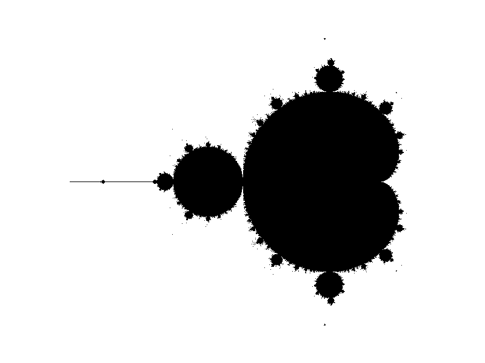

# Simple Go Mandelbrot Renderer

This is just a quick toy package to dust off some Go :)

[https://en.wikipedia.org/wiki/Mandelbrot_set](https://en.wikipedia.org/wiki/Mandelbrot_set)

## TODO:

- benchmark
- goroutine it
