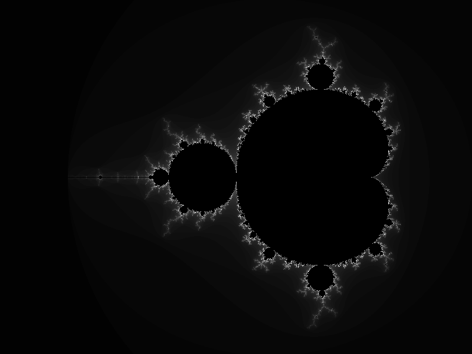

# Simple Go Mandelbrot Renderer

This is just a quick toy project to dust off some Go :)

[https://en.wikipedia.org/wiki/Mandelbrot_set](https://en.wikipedia.org/wiki/Mandelbrot_set)

*Figure 1: Generated Mandelbrot set visualization*

## TODO:

- patches instead of rows